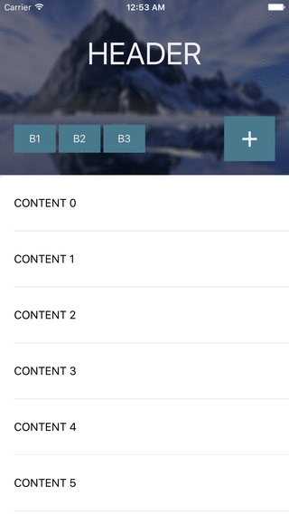

# MGCollapsingHeader

[](https://cocoapods.org/pods/MGCollapsingHeader)
[](https://opensource.org/licenses/MIT)

An iOS UIView subclass to manage collapsing and expanding of a header view. Subviews of the header are configured to transform to any collapsed layout. The header is intended to work with a UIScrollView or UITableView as the user scrolls through content, but by all means can be used in other ways.



##Requirements
- This UIView subclass relies on constraints to transform subviews. AutoLayout is assumed to be enabled and used.   
- Supports iOS 7+

##Installation
###### With [CocoaPods](https://cocoapods.org/):
```ruby
pod 'MGCollapsingHeader'
```

Or simply copy the `MGCollapsingHeader/` folder into your project.

##How to use
To use the collapsible header, you must first configure your `UIViewController` with a header view. Simply set the Class of this view as `MGCollapsingHeaderView` and it will be ready to setup. The view collapses to a size of 60 px by default, but can be set:
```objc
[self.headerView setMinimumHeaderHeight:100.]
```   
   
You can then provide the top `NSLayoutConstraint` of a body view to expand as the header collapses.  
```objc
[self.headerView setBodyViewTop:self.tableViewTop]
```   
   
Next, add any views to animate with the header as it collapses. Two methods are available to you:   
- `addTransformingSubview:attributes:` Adds a view that transforms as the user scrolls. An array of `MGTransformAttribute` must be provided to describe the transformation. See [Attributes](#attributes) for more.
- `addFadingSubview:fadeBy:` Adds a view that fades as the user scrolls.   
Here are some examples from the Demo:   
```objc
[self.headerView setDelegate:self];
[self.headerView setBodyViewTop:self.tableViewTop];
[self.headerView addFadingSubview:self.button1 fadeBy:.3];
[self.headerView addFadingSubview:self.button2 fadeBy:.3];
[self.headerView addFadingSubview:self.button3 fadeBy:.3];

NSArray *attrs;
double r = 18.;
attrs = @[[MGTransform attribute:MGAttributeX value:self.button4.frame.origin.x - r],
		  [MGTransform attribute:MGAttributeY value:self.button4.frame.origin.y - r],
		  [MGTransform attribute:MGAttributeWidth value:2*r],
		  [MGTransform attribute:MGAttributeHeight value:2*r],
		  [MGTransform attribute:MGAttributeCornerRadius value:r],
		  [MGTransform attribute:MGAttributeFontSize value:15.]];
[self.headerView addTransformingSubview:self.button4 attributes:attrs];

attrs = @[[MGTransform attribute:MGAttributeX value:520.],
		  [MGTransform attribute:MGAttributeY value:20.],
		  [MGTransform attribute:MGAttributeWidth value:40.],
		  [MGTransform attribute:MGAttributeHeight value:35.]];
[self.headerView addTransformingSubview:self.button5 attributes:attrs];

attrs = @[[MGTransform attribute:MGAttributeY value:20.],
		  [MGTransform attribute:MGAttributeWidth value:120.],
		  [MGTransform attribute:MGAttributeHeight value:34.],
		  [MGTransform attribute:MGAttributeCornerRadius value:17.],
		  [MGTransform attribute:MGAttributeFontSize value:25.]];
[self.headerView addTransformingSubview:self.label attributes:attrs];
```   
   
Lastly, trigger the header view to collapse by an offset. It will animate if the value is less than the `minimumHeaderHeight` and at most the height originally set. If using scrolling, the `scrollViewDidScroll` delegate call is the ideal place for this.
```objc
- (void)scrollViewDidScroll:(UIScrollView *)scrollView {
	[self.headerView collapseToOffset:scrollView.contentOffset];
}
```   
   
###Attributes   
Attributes are used to describe a subview at the end of collapsing. The following are currently available:   
`MGAttributeX`  
`MGAttributeY`  
`MGAttributeWidth`  
`MGAttributeHeight`  
`MGAttributeAlpha`  
`MGAttributeCornerRadius`  
`MGAttributeShadowRadius`  
`MGAttributeShadowOpacity`  
`MGAttributeFontSize`  

The view's attributes will be (linearly) animated to from their default values.   

##TODO
- Transformation curve functions (EaseIn, EaseOut, EaseInOut)   
