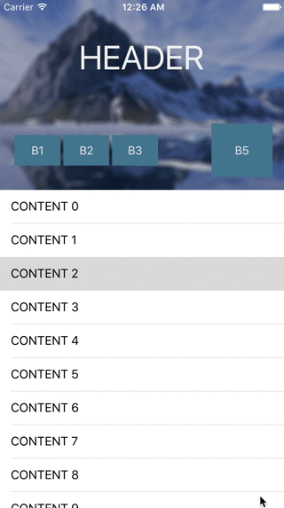

# MGCollapsingHeader

[](https://cocoapods.org/pods/MGCollapsingHeader)
[](https://opensource.org/licenses/MIT)

An iOS UIView subclass to manage collapsing and expanding of a header view. Subviews of the header are configured to transform to any collapsed layout. The header works with any UIScrollView, and transforms views as the user scrolls through content.



##Requirements
- Autolayout (constraints are relied on to transform subviews)
- Supports iOS 7+

##Installation
###### With [CocoaPods](https://cocoapods.org/):
```ruby
pod 'MGCollapsingHeader'
```

Or simply copy the `MGCollapsingHeader/` folder into your project.

##How to use
To use the collapsible header, you must first setup your `UIViewController` with a header view. Simply set the class of this view to `MGCollapsingHeaderView` and then you can configure how to transform the header. The view collapses to a size of 60 px by default, but can be set:
```objc
[self.headerView setMinimumHeaderHeight:100.]
```   
   
You can then provide a vertical constraint (or constraints) to collapse, whether it be the header's top, bottom, or height.  
```objc
[self.headerView setCollapsingConstraint:_headerHeight]
// or
[self.headerView setCollapsingConstraint:_tableViewTop];
```  

Next, add any views to transform with the header as it collapses:  
- `[MGTransform transformAttribute:byValue:]` Adds a view that transforms by some value as the user scrolls. An array of `MGTransformAttribute` must be provided to describe the transformation. See [Attributes](#attributes) for what is supported.
- `[MGTransform addFadingSubview:fadeBy:]` Adds a view that fades as the user scrolls.   

Examples (from the demo):   
```objc
[self.headerView addFadingSubview:self.button1 fadeBy:0.3];
[self.headerView addFadingSubview:self.button2 fadeBy:0.3];
[self.headerView addFadingSubview:self.button3 fadeBy:0.3];

NSArray *attrs;
double r = 16.0;
attrs    = @[
    [MGTransform transformAttribute:MGAttributeX byValue:-r],
    [MGTransform transformAttribute:MGAttributeY byValue:-r],
    [MGTransform transformAttribute:MGAttributeWidth byValue:2 * r],
    [MGTransform transformAttribute:MGAttributeHeight byValue:2 * r],
    [MGTransform transformAttribute:MGAttributeCornerRadius byValue:r],
    [MGTransform transformAttribute:MGAttributeFontSize byValue:12.0]
];
[self.headerView addTransformingSubview:self.button4 attributes:attrs];

// Push this button closer to the bottom-right corner since the header view's height
// is resizing.
attrs = @[
    [MGTransform transformAttribute:MGAttributeX byValue:10.0],
    [MGTransform transformAttribute:MGAttributeY byValue:13.0],
    [MGTransform transformAttribute:MGAttributeWidth byValue:-32.0],
    [MGTransform transformAttribute:MGAttributeHeight byValue:-32.0]
];
[self.headerView addTransformingSubview:self.button5 attributes:attrs];

attrs = @[
    [MGTransform transformAttribute:MGAttributeY byValue:-30.0],
    [MGTransform transformAttribute:MGAttributeWidth byValue:-30.0],
    [MGTransform transformAttribute:MGAttributeHeight byValue:-20.0],
    [MGTransform transformAttribute:MGAttributeFontSize byValue:-10.]
];
[self.headerView addTransformingSubview:self.label attributes:attrs];
```   
   
Lastly, tell the header view to collapse in the `scrollViewDidScroll` delegate call.
```objc
- (void)scrollViewDidScroll:(UIScrollView *)scrollView
{
    [self.headerView collapseWithScroll:scrollView];
}
```   
   
###Attributes   
Attributes are used to describe a subview at the end of collapsing. The following are currently available:   
`MGAttributeX`  
`MGAttributeY`  
`MGAttributeWidth`  
`MGAttributeHeight`  
`MGAttributeAlpha`  
`MGAttributeCornerRadius`  
`MGAttributeShadowRadius`  
`MGAttributeShadowOpacity`  
`MGAttributeFontSize`  

The view's attributes will be (linearly) animated to from their default values.   

##TODO
- Transformation curve functions (EaseIn, EaseOut, EaseInOut)   
