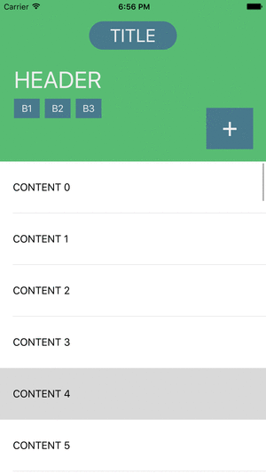

# MGCollapsibleHeader
A UIView subclass to manage collapsing and expanding of a header view. Subviews of the header are configured to transform to any collapsed layout. The header is intended to work with a UIScrollView or UITableView as the user scrolls through content, but by all means can be used in other ways.



##Installation
###### With [Cocoa Pods](https://cocoapods.org/):
```ruby
pod 'MGCollapsibleHeader'
```

Or simply copy the `MGCollapsibleHeader/` folder into your project.

##How to use
To use the collapsible header, you must first configure your `UIViewController` with a header view. Simply set the Class of this view as `MGCollapsibleHeaderView` and it will be ready to configure. The view collapses to a size of 60 px by default, but can be set:
```objc
[self.headerView setMinimumHeaderHeight:100.]
```   
   
You can then provide the top `NSLayoutConstraint` of a body view to expand as the header collapses.  
```objc
[self.headerView setBodyViewTop:self.tableViewTop]
```   
   
Next, add any subviews of the header (or any views really), to animate with the header as it collapses. Two methods are available to you:   
- `addTransformingSubview:attributes:` Adds a subview of the header that transforms as the user scrolls. See [Attributes](#attributes) for more on how to configure the transformation.    
- `addFadingSubview:fadeBy:` Adds a subview of the header that fades as the user scrolls.   
Here are some examples from the Demo:   
```objc
	[self.headerView addFadingSubview:self.button1 fadeBy:.4];
	[self.headerView addFadingSubview:self.label fadeBy:.75];
	[self.headerView addTransformingSubview:self.button4
								 attributes:@[[MGTransformAttribute attribute:MGAttributeX value:520.],
											  [MGTransformAttribute attribute:MGAttributeY value:20.],
											  [MGTransformAttribute attribute:MGAttributeWidth value:40.],
											  [MGTransformAttribute attribute:MGAttributeHeight value:35.]]];
	[self.headerView addTransformingSubview:self.titleLabel
								 attributes:@[[MGTransformAttribute attribute:MGAttributeY value:20.],
											  [MGTransformAttribute attribute:MGAttributeWidth value:120.],
											  [MGTransformAttribute attribute:MGAttributeHeight value:34.],
											  [MGTransformAttribute attribute:MGAttributeCornerRadius value:17.]]];
```   
   
Lastly, trigger the header view to collapse. If using scrolling, the `scrollViewDidScroll` delegate call is the ideal place for this.
```objc
- (void)scrollViewDidScroll:(UIScrollView *)scrollView {
	[self.headerView collapseToOffset:scrollView.contentOffset];
}
```   
   
###Attributes   
Attributes are used to describe a subview at the end of collapsing. The following are currently available:   
`MGAttributeX`  
`MGAttributeY`  
`MGAttributeWidth`  
`MGAttributeHeight`  
`MGAttributeAlpha`  
`MGAttributeCornerRadius`  
`MGAttributeShadowRadius`  
`MGAttributeShadowOpacity`  

These attributes will be (linearly) animated to from their default values of the corresponding view.   

##TODO
- Transformation curve functions (EaseIn, EaseOut, EaseInOut)   
- Add delegate calls   
